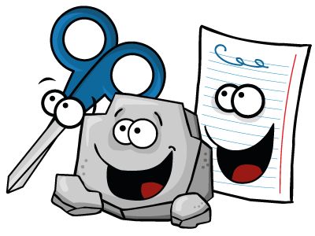
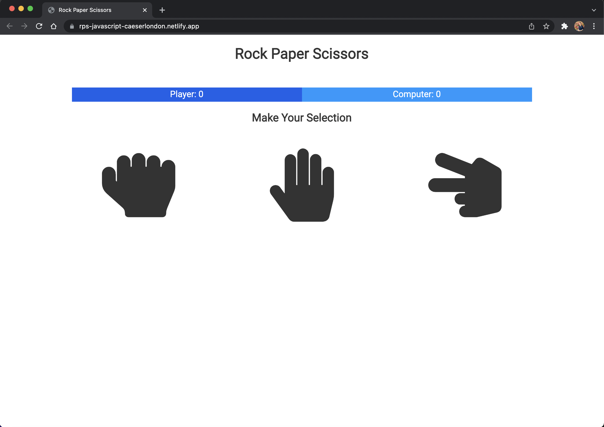
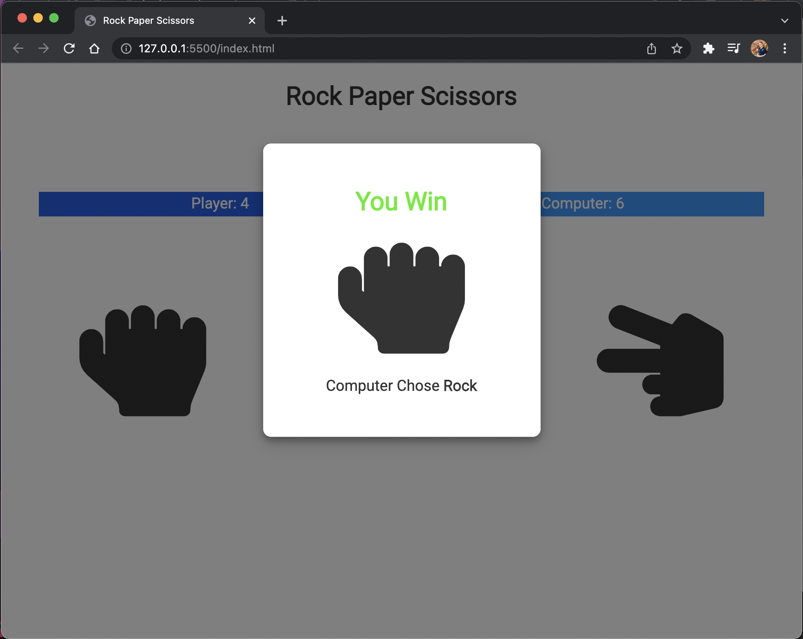

# Rock Paper Scissor ... UI and JavaScript

### Using JavaScript, HTML and CSS to build a Rock Paper Scissors Game.

<a href="https://rps-javascript-caeserlondon.netlify.app" target="_blank"><h2>visit the deployed website on Netlify</h2></a>

---

[visit the deployed website on Netlify](https://rps-javascript-caeserlondon.netlify.app)

---

### You pick your move

### Have Fun!

### And the computer will pick

